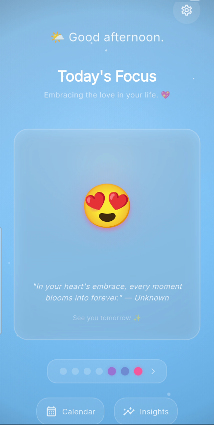
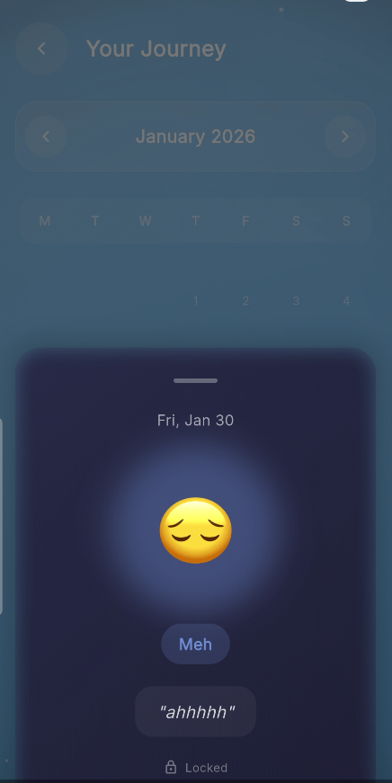
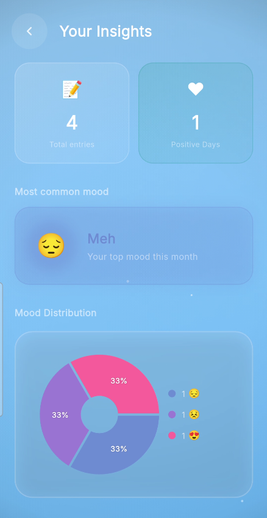
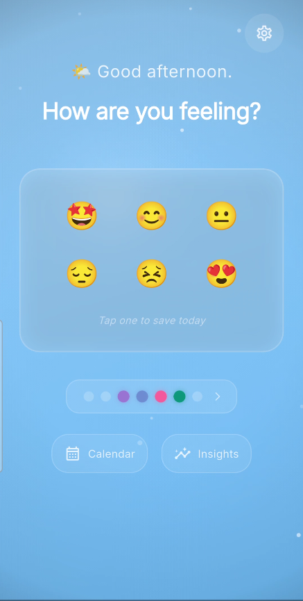
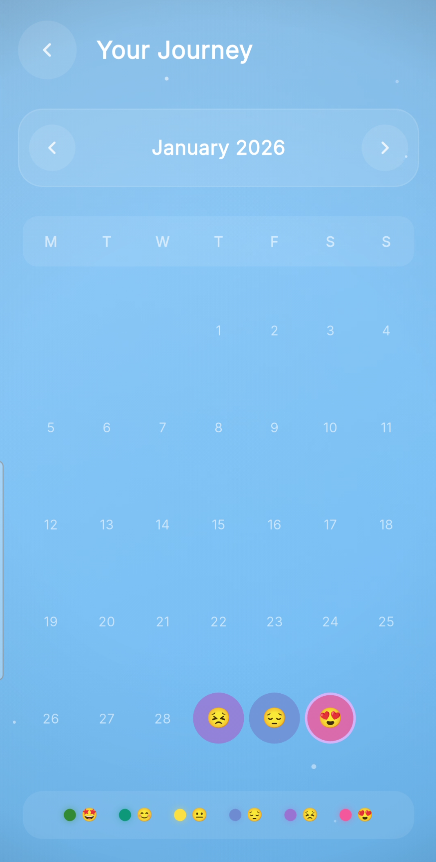

<div align="center">
  

  <h1>OneTap</h1>
  <p><strong>A local-first mood journal built with Flutter.</strong></p>
  <p>Record how you feel, add a short note, and explore your mood history over time.</p>

  <p>
    <a href="https://flutter.dev"></a>
    <a href="https://github.com/Maher-Tec/OneTap"></a>
    <a href="LICENSE"></a>
    
  </p>
</div>

OneTap is a personal mood-tracking app. It keeps entries on the device and provides calendar history, charts, streaks, goals, and achievements. The project is built with Flutter and uses Riverpod for app state and Hive for local persistence.

## Contents

- [Features](#features)
- [Screenshots](#screenshots)
- [App flow](#app-flow)
- [Technology](#technology)
- [Project structure](#project-structure)
- [Requirements](#requirements)
- [Run locally](#run-locally)
- [Demo data](#demo-data)
- [Data and privacy](#data-and-privacy)
- [Notifications](#notifications)
- [Tests and analysis](#tests-and-analysis)
- [Contributing](#contributing)
- [License](#license)

## Features

- Log one of six moods each day: **Great**, **Good**, **Okay**, **Meh**, **Rough**, or **In Love**.
- Add an optional note of up to 300 characters.
- Change the mood or note for the current day by saving again.
- Browse entries in a monthly calendar and inspect individual saved days.
- View monthly mood distribution, mood trends, day-of-week summaries, and streak statistics.
- Create monthly goals for positive days, great days, or consistent logging.
- Track progress toward goals and unlock achievements from journal activity.
- Configure a daily local reminder time.
- Use mood-specific Lottie animations, haptic feedback, and animated screen effects.
- Keep journal entries, goals, settings, and achievement progress in local Hive storage.

## Screenshots

Screenshots are stored in [`screens/`](screens/).

<div align="center">
  
  
  
  
  
</div>

## App flow

1. **Home:** Select a mood. Once saved, Home shows the saved mood, recent history, and a supportive local message.
2. **Note:** Optionally add a note, then save or skip.
3. **Confirmation:** See a save confirmation and continue to Home or Calendar.
4. **Calendar:** Browse monthly entries and tap a logged day to view its note and mood.
5. **Insights:** Explore monthly mood distribution, a mood trend line, and weekday summaries.
6. **Goals:** Create a monthly mood or logging goal and follow its progress.
7. **Achievements:** Review achievement badges and progress earned from journal activity.
8. **Settings:** Configure a daily reminder or reset journal data, goals, and achievement progress.

## Mood scoring and charts

Each date has one mood entry. The six moods map to a 0–4 scale for analytics: Rough = 0, Meh = 1, Okay = 2, Good = 3, and Great/In Love = 4. The app also uses the mood labels and categories for positive-day and goal calculations.

The Insights screen uses [`fl_chart`](https://pub.dev/packages/fl_chart) for a **pie chart** of mood distribution and a **line chart** of mood trends. Additional weekday summaries are rendered with Flutter widgets. Missing days are not stored as entries.

## Technology

### Runtime dependencies

| Package | Use |
| --- | --- |
| [`flutter_riverpod`](https://pub.dev/packages/flutter_riverpod) | Providers and state notifiers for journal, settings, goals, and achievements |
| [`hive`](https://pub.dev/packages/hive) / [`hive_flutter`](https://pub.dev/packages/hive_flutter) | On-device storage |
| [`fl_chart`](https://pub.dev/packages/fl_chart) | Mood distribution and trend charts |
| [`lottie`](https://pub.dev/packages/lottie) | Bundled mood animations |
| [`flutter_local_notifications`](https://pub.dev/packages/flutter_local_notifications) | Local reminder and streak notifications |
| [`flutter_timezone`](https://pub.dev/packages/flutter_timezone) / [`timezone`](https://pub.dev/packages/timezone) | Local-time scheduling for reminders |
| [`google_fonts`](https://pub.dev/packages/google_fonts) | App typography |
| [`intl`](https://pub.dev/packages/intl) | Date formatting |

### Development dependencies

- `flutter_test` and `flutter_lints` for tests and linting.
- `hive_generator` and `build_runner` for generated Hive adapters.
- `flutter_launcher_icons` for platform launcher icon generation.

## Project structure

```text
lib/
├── core/
│   ├── constants/       # Mood levels, strings, colors, durations, achievement catalog
│   ├── services/        # Local notification service
│   ├── theme/           # Flutter theme
│   └── utils/           # Date and haptic helpers
├── data/
│   ├── demo/            # Optional demo-data seeder
│   ├── models/          # Hive models and generated adapters
│   └── repositories/    # Journal, goal, and achievement persistence
├── providers/           # Riverpod providers and notifiers
├── screens/             # Home, journal, calendar, insight, goal, and settings screens
└── widgets/             # Shared controls, mood widgets, charts, and visual effects

assets/
├── animation/           # Lottie mood animations
└── images/              # In-app logo and launcher icon sources

test/                    # Unit and widget tests
screens/                 # README screenshots
```

## Requirements

- Flutter SDK with Dart **3.10.3 or later** (see the SDK constraint in `pubspec.yaml`).
- A Flutter-supported device, emulator, or desktop target configured for your development environment.
- For local notifications, a target platform with notification support and the required native permissions/configuration.

## Run locally

```bash
git clone https://github.com/Maher-Tec/OneTap.git
cd OneTap
flutter pub get
flutter run
```

No API keys, `.env` file, account, or backend are required to run the app.

### Regenerate Hive adapters

If you change a Hive model, regenerate its adapter with:

```bash
dart run build_runner build --delete-conflicting-outputs
```

### Regenerate app icons

The icon source files are `assets/images/icon.png` for launcher icons and `assets/images/logoo.png` for the in-app Home logo. After changing the launcher source, run:

```bash
dart run flutter_launcher_icons
```

## Demo data

The repository includes a sample-data seeder intended for screenshots and demo recordings. To enable it:

```bash
flutter run --dart-define=ONETAP_DEMO_MODE=true
```

In VS Code, select **OneTap (Demo Data)** in Run and Debug and press **F5**. The seeder adds sample entries for missing dates in the recent history and leaves today available for a live mood-entry demonstration. It does not overwrite entries already saved for those dates. Demo entries are stored in the same local Hive box and remain there when demo mode is turned off; use a separate emulator or clear the app's local data before recording if you need a clean profile.

## Data and privacy

- There is no application server, user account, analytics SDK, or cloud-sync implementation in this project.
- Mood entries, notes, settings, goals, and achievement progress are stored locally using Hive.
- The app does not implement a separate encryption layer for journal data. Treat access to the device and its app data accordingly.
- Reset All Data clears journal entries and goals, restores settings, and resets achievement progress.
- Demo data is written to local storage only when demo mode is explicitly enabled.

## Notifications

Daily reminders and streak milestone messages use local notifications. Delivery depends on operating-system notification permissions and platform configuration. The app does not currently request notification permission automatically when reminders are enabled, so permission may need to be granted separately on the device.

## Tests and analysis

Run the existing test suite and Dart/Flutter analyzer with:

```bash
flutter test
flutter analyze
```

## Contributing

Contributions are welcome. Before opening a pull request:

See [`CONTRIBUTING.md`](CONTRIBUTING.md) for setup, code style, and pull request guidance.

Please do not include real journal data, credentials, or private user information in issues, screenshots, or pull requests.

## License

This project is licensed under the [MIT License](LICENSE). You may use, modify, and distribute it under the terms of that license.

## Acknowledgements

OneTap is built with Flutter and the open-source packages listed in [`pubspec.yaml`](pubspec.yaml). See each package's repository for its license and attribution requirements.
